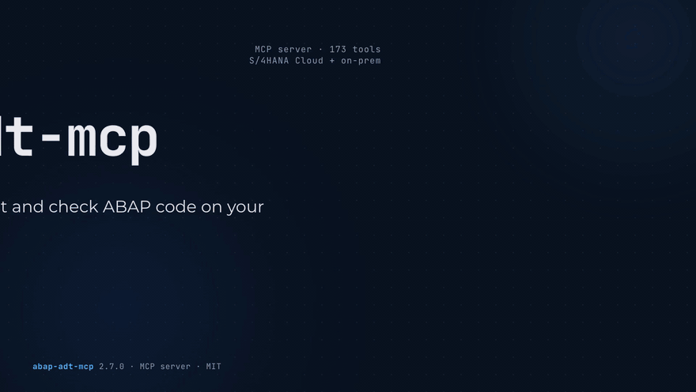

# abap-adt-mcp

**Let Claude read, write, test and check ABAP code on your SAP systems.**

English · [Português (Brasil)](docs/i18n/README.pt-BR.md) · [Deutsch](docs/i18n/README.de.md) · [Project site](https://williansaez.github.io/abap-adt-mcp/)

[](https://www.npmjs.com/package/abap-adt-mcp)
[](https://github.com/williansaez/abap-adt-mcp/actions/workflows/ci.yml)
[](LICENSE)
[](https://nodejs.org)
[](https://registry.modelcontextprotocol.io/?search=abap-adt-mcp)
[](https://williansaez.github.io/abap-adt-mcp/)

You type a sentence in Claude. You get back an activated class, green unit tests and a transport number. abap-adt-mcp is the server in between: a [Model Context Protocol](https://modelcontextprotocol.io) server that gives Claude Desktop, Claude Code, VS Code or any other MCP host the same ADT services Eclipse uses, on every SAP system you configure, S/4HANA Cloud and on-prem alike. **173 tools**, one process, and guard rails the server enforces itself: a destination marked read-only refuses every write before it reaches SAP, whatever the host approves.

**See it in motion.** The [project site](https://williansaez.github.io/abap-adt-mcp/) has seven short films, the setup in three steps and what to ask the model.

> **Before you connect a production system**
>
> - The model acts as your SAP user and can do nothing Eclipse would refuse you. What it reads (source, dumps, table rows where you open them) is sent to the model.
> - A destination without a [`policy`](#policy-keys) block is writable in every package your user may edit; table data stays closed until you open it.
> - Recommended: development and test systems only. If a production destination must exist, give it the `PRD` policy of [step 4](#4-add-production-and-on-prem-systems): the server enforces it before any SAP call, whatever the host approves, so a careless prompt cannot write where the policy forbids it ([For administrators](#for-administrators)).

## See it work



That is the whole idea. You type a sentence. The model picks the tools, the server locks the object, writes, activates and unlocks it, and the unit tests come back green with a transport number attached. Ask for the same change on a production system and the answer is `policyDenied` before a single SAP call goes out: the guard rails live in the server, not in the chat window.

Seven short films show this and the single jobs behind it, a short dump traced to its line, an ATC run with its quickfixes, a transport review, a class created with its test, an ABAP Cloud readiness check. They are on the [project site](https://williansaez.github.io/abap-adt-mcp/#watch).

## Table of contents

- [See it work](#see-it-work)
- [Setup](#setup)
- [What to ask the model](#what-to-ask-the-model)
- [For administrators](#for-administrators)
- [Authentication](#authentication)
- [S/4HANA Cloud versus on-prem](#s4hana-cloud-versus-on-prem)
- [Other ways to install](#other-ways-to-install)
- [Configuration](#configuration)
- [Tool catalog](#tool-catalog)
- [Compared with SAP's official ADT MCP Server](#compared-with-saps-official-adt-mcp-server)
- [SAP API Policy](#sap-api-policy)
- [Troubleshooting](#troubleshooting)
- [Testing and contributing](#testing-and-contributing)
- [Credits](#credits)
- [License](#license)

## Setup

Three prerequisites:

- **Node.js 22.12 or newer** (22 or 24 LTS) from [nodejs.org](https://nodejs.org). On a managed laptop the ticket to IT is one line: "Please install Node.js LTS (22 or newer)"; nothing else needs installing.
- **Access to the SAP system**, the same as for Eclipse ADT: on S/4HANA Cloud the developer business role (`SAP_BR_DEVELOPER` in the standard delivery); on-prem, ask your Basis team for the `/sap/bc/adt` service in `SICF` and the usual ADT authorizations.
- **A Chromium browser** (Chrome, Edge or Brave) for the browser login (`authType: sso`, the default); not needed for `basic`, `oauth` or `sso2`.

### 1. Describe your SAP systems

Create the folder `.abap-adt-mcp` in your home directory and the file `systems.json` inside it, one entry per system (a "destination"):

- Windows: the folder is `C:\Users\<your user name>\.abap-adt-mcp`. Paste the JSON into Notepad and in Save As set "Save as type" to "All files" and the name to `systems.json`, otherwise Notepad saves `systems.json.txt` and the server finds nothing.
- macOS: the folder is `/Users/<you>/.abap-adt-mcp` (Finder, Shift-Cmd-G, `~`); any editor.

```json
{
  "DEV": {
    "url": "https://myXXXXXX.s4hana.cloud.sap",
    "client": "080",
    "authType": "sso",
    "default": true,
    "policy": { "allowedPackages": ["ZFIN"] }
  }
}
```

- `DEV` is your name for the system and the word you will use in chats; `"default": true` lets you omit it.
- `url`: the address you open the launchpad or Eclipse with, without a path.
- `client`: the client your SSO session logs on to (About in the launchpad's user menu shows it). A wrong client shows up later as "not authorized" on objects you can open in Eclipse.
- `authType` defaults to `sso`: a browser window opens once for the login, like Eclipse ADT. Other modes: [Authentication](#authentication).
- `policy.allowedPackages`: the packages the model may write to, exact names or patterns (`ZFIN`, `Z*`). Leave it out and every package you can edit in Eclipse is writable; start with one.

Production and on-prem systems come in [step 4](#4-add-production-and-on-prem-systems), after the first successful call.

### 2. Register the server in your host

The package is on npm as [`abap-adt-mcp`](https://www.npmjs.com/package/abap-adt-mcp); `npx` fetches it. Claude Desktop, no terminal: first block. Claude Code: one command. VS Code, Cursor and others: pointer below. Every entry passes the server two settings: `SAP_SYSTEMS_FILE` (where `systems.json` is) and `MCP_TOOLSETS=focused`, which publishes the 114 everyday development tools instead of all 173 so the tool schemas do not eat the chat's context (drop it when you need the debugger, traces, abapGit, RAP or refactoring).

**Claude Desktop**, no terminal needed:

1. Settings > Developer > Edit Config opens the folder that holds `claude_desktop_config.json`; open the file in Notepad or any editor. If Settings has no Developer tab, your Claude Desktop is managed by IT: ask them to add the entry below.
2. If the file already contains `"mcpServers"`, add only the `"abap-adt-mcp"` entry inside it; if it is empty, paste the whole block.
3. Replace `<you>` with your user name (macOS: `/Users/<you>/.abap-adt-mcp/systems.json`). The forward slashes in the Windows path are deliberate: JSON needs `\\` for every backslash, forward slashes need nothing.
4. Quit and reopen the app.

```json
{
  "mcpServers": {
    "abap-adt-mcp": {
      "command": "npx",
      "args": ["-y", "abap-adt-mcp"],
      "env": { "SAP_SYSTEMS_FILE": "C:/Users/<you>/.abap-adt-mcp/systems.json", "MCP_TOOLSETS": "focused" }
    }
  }
}
```

**Claude Code**, one line in a terminal (`-s user` registers the server for every project, not only the current folder):

```bash
claude mcp add -s user abap-adt-mcp -e SAP_SYSTEMS_FILE=$HOME/.abap-adt-mcp/systems.json -e MCP_TOOLSETS=focused -- npx -y abap-adt-mcp
```

The same on Windows PowerShell:

```powershell
claude mcp add -s user abap-adt-mcp -e SAP_SYSTEMS_FILE=$env:USERPROFILE\.abap-adt-mcp\systems.json -e MCP_TOOLSETS=focused -- npx -y abap-adt-mcp
```

**VS Code with GitHub Copilot**: the same entry in `.vscode/mcp.json` under a top-level `servers` key instead of `mcpServers`; [docs/HOSTS.md](docs/HOSTS.md#vs-code-with-github-copilot-agent-mode) has the file as tested, with `${input:}` for secrets.

- Cursor, Cline, Windsurf, the Copilot CLI and Eclipse: [docs/HOSTS.md](docs/HOSTS.md).
- Keep the key `abap-adt-mcp`: it is the name the host shows, the prefix of every tool, and what this project's agent skills look for.

### 3. Say hello

Open a new chat and type (replace `DEV` with the key you chose; the class is standard SAP, so the prompt is read-only and safe on any system):

> List my SAP systems, log in to DEV and show me the source of class CL_ABAP_CHAR_UTILITIES.

A browser window opens for the SSO login (tick "stay signed in" and later logins are silent); the model then calls `listSystems`, `searchObject` and `getObjectSource`, and the reply names your destinations and ends with the class source. The host asks before running a tool you have not approved permanently: that dialog is a courtesy of the host, the `policy` block is the guarantee. If the server does not appear in the host, [Troubleshooting](#troubleshooting) names the log to read.

Two things worth knowing before the first edit:

- A write the policy forbids comes back as a refusal, not as a silent no-op: `kind: "policyDenied"`, `Policy: setObjectSource blocked on destination PRD (readOnly)`.
- Every change the model makes is on your transport and in the object's version history: `objectDiff` and `revisions` show it, and nothing leaves DEV without a transport release you approve.

### 4. Add production and on-prem systems

The same file with a production entry and an on-prem entry ([systems.example.json](docs/systems.example.json) has every option):

```json
{
  "DEV": {
    "url": "https://myXXXXXX.s4hana.cloud.sap",
    "client": "080",
    "authType": "sso",
    "default": true,
    "policy": { "allowedPackages": ["Z*"] }
  },
  "PRD": {
    "url": "https://myYYYYYY.s4hana.cloud.sap",
    "client": "100",
    "authType": "sso",
    "policy": { "readOnly": true, "allowDataPreview": false, "deniedTools": ["exportPackageSources"] }
  },
  "ONPREM": {
    "url": "https://sap.example.com:44300",
    "client": "100",
    "authType": "basic",
    "user": "DEVELOPER",
    "password": "${env:ONPREM_PASSWORD}",
    "policy": { "allowedPackages": ["Z*", "$*"] },
    "tls": { "ca": "/etc/ssl/corp-ca.pem" }
  }
}
```

- If a production destination must exist, `PRD` is its minimum policy: `readOnly` refuses every write, whatever the model is asked; `allowDataPreview: false` keeps table data closed even where the environment opens it for other destinations; `deniedTools` closes `exportPackageSources`, the one read that copies whole packages to disk.
- `${env:VAR}` reads a secret from the environment, so it never sits in the file; add the variable where the host starts the server: `-e ONPREM_PASSWORD=...` on `claude mcp add` (or export it in the shell that starts Claude Code), a `"ONPREM_PASSWORD": "..."` line in the `env` block of Claude Desktop, which does not pass your shell environment on. A file with an inline password must be readable by you only (`chmod 600 ~/.abap-adt-mcp/systems.json` on macOS and Linux; on Windows your profile folder is already private); an SSO-only file needs nothing.
- `tls.ca` names a corporate CA certificate. Verification can be relaxed per destination only (`insecureTls: true`, announced at startup), never for the whole process.

That is the whole setup. Next: [What to ask the model](#what-to-ask-the-model).

## What to ask the model

The server is a toolbox the model picks from: ask in plain language and it chooses the sequence.

| Ask | Tools the model reaches for |
|---|---|
| "Explain what method GET_DATA of ZCL_ORDER_SERVICE does." | `searchObject`, `getMethodSource` |
| "Where is table ZTABLE still used, and by which programs?" | `whereUsed`, `sourceTextSearch`, `grepPackage` |
| "Show me the fields and associations of CDS view ZI_PRODUCT." | `cdsViewInfo`, `objectStructureElements` |
| "Add a null check at the top of GET_DATA, activate and run the unit tests." | `resolveTransport`, `syntaxCheckCode`, `editObjectSource` (with `activate=true`), `unitTestRun`, `objectDiff` |
| "Create class ZCL_HELLO in package ZDEMO that prints Hello World, with a unit test." | `validateNewObject`, `resolveTransport`, `createObject`, `setObjectSource`, `createTestInclude`, `unitTestRun` |
| "Run ATC on package ZFIN and apply every quickfix that is safe." | `createAtcRun`, `atcWorklists`, `atcQuickfixProposals`, `atcApplyQuickfix`, `atcSummary` |
| "What changed in transport `DEVK900123`? Review it and tell me if it is safe to release." | `transportDetails`, `transportUnifiedDiff` |
| "Why did the last short dump of user DEVELOPER happen? Propose a fix." | `dumps`, `dumpDetails`, `getObjectSource` |
| "Is ZCL_ORDER_SERVICE ready for ABAP Cloud? Which SAP objects block it?" | `apiReleaseState`, `createAtcRun` |
| "Select the ten newest rows of ZTABLE where STATUS = 'X'." | `runQuery`, or `tableContents` when the data preview refuses a table |
| "Try this snippet and show me the output." | `runSnippet` |
| "Which toolsets does DEV support? Is the debugger available there?" | `systemProfile` |

What the server does on its own, so you do not have to spell it out:

- Write tools lock, write and unlock by themselves; `activate=true` activates in the same call.
- Every error comes back as JSON with `kind`, `hint` and `nextTools`, so the model recovers instead of retrying blindly; an expired session is re-authenticated and the call retried once.
- Large results are paged inside a 40,000-character budget and report `hasMore`; long calls send progress notifications.
- Table reads run only where the destination allows them: `tableContents` by name needs `allowDataPreview`, `runQuery` needs `allowFreeSql`.
- The create and edit flows travel in the MCP `instructions` field, and six ready-made workflows ship as MCP prompts (`create-object`, `safe-edit`, `review-transport`, `fix-atc`, `clean-core-check`, `debug-dump`; in Claude Code `/mcp__abap-adt-mcp__safe-edit DEV ZCL_ORDER_SERVICE "return early when the input table is empty"`).
- Every tool carries `readOnlyHint`/`destructiveHint` annotations, so hosts that gate approval by annotation ask only on writes.

The tool-by-tool sequences, argument shapes and recipes are in [docs/WORKFLOWS.md](docs/WORKFLOWS.md).

## For administrators

What the server is, in the terms a landscape owner asks about:

- **Identity.** Every call reaches SAP as the user of the destination, with that user's authorizations; the server removes no SAP check and has no access the user does not have. With `sso` and `sso2` that user is the person at the keyboard; `basic` and `oauth` carry stored credentials, so prefer named users where accountability matters. The authorizations of a display-only SAP user are listed in [docs/CONFIGURATION.md](docs/CONFIGURATION.md#on-prem-production-read-only-with-a-dedicated-display-user).
- **Process.** One process per person, started by the MCP host, speaking stdio; nothing listens on the network unless you start the optional [HTTP transport](docs/CONFIGURATION.md#6-http-transport).
- **Network.** It talks to the configured SAP hosts, to the identity provider during browser SSO, and to `raw.githubusercontent.com` for SAP's cloudification repository when `apiReleaseState` runs (cached 24 hours; `deniedTools: ["apiReleaseState"]` keeps that off the network). No telemetry, no update checks; `npx` itself contacts the npm registry.
- **What the model sees.** The result of every tool call the user approves (source, table rows where opened, dumps, ATC findings, error text after redaction) goes to the MCP host and from there to the model provider under the host's own data terms (the host decides the provider, not this server); the server sends nothing anywhere else. `readOnly`, `deniedTables` and `deniedTools` bound that set per destination.
- **Disk.** `~/.abap-adt-mcp/`: `systems.json` (yours), the SSO browser profile per host (`sso/<host>`, mode `0700`), the cloudification cache, package exports (`exports/`, only where `exportPackageSources` may write), the HTTP token and, when enabled, the audit log. SAP session cookies are never written to disk.
- **Secrets.** `${env:VAR}` works in every string of `systems.json`; a file readable by others is refused when it holds inline passwords. Error messages pass through a redaction step (bearer tokens, cookies, passwords, `user:password@host` URLs); successful tool results are not redacted, so `readOnly`, `deniedTables` and `deniedTools` are what bounds them. `reentranceTicket` (a logon ticket the model could carry elsewhere) stays disabled unless `SAP_ALLOW_REENTRANCE_TICKET=1`.
- **What the policy cannot see.** ABAP the model runs (`runSnippet`, `runClass`, `unitTestRun`) executes with the user's authorizations; `deniedTables` scans the snippet text, but dynamic SQL and whatever the code calls are not inspected. Where code execution is unacceptable, list those tools in `deniedTools` or use `readOnly`.
- **Untrusted input.** Comments, table rows and feeds from SAP can carry text that tries to steer the model. Use a host that asks before tool calls and review the tools in bold in the [Tool catalog](#tool-catalog) (the destructive ones) before approving.
- **Audit.** `MCP_AUDIT_FILE=/var/log/abap-adt-mcp/audit.jsonl` appends one JSON line per call: tool, destination, outcome, duration, the policy gate that refused it, and the arguments with secrets redacted. The file is written per workstation by the user's own process; central collection and tamper protection are yours to arrange. [docs/CONFIGURATION.md](docs/CONFIGURATION.md#7-audit-log-record-format) has the record format.
- **SAP API Policy.** SAP calls the ADT services this server uses internal, for development through the channels it endorses, and this project is not among them; unpublished interfaces are used at own risk. Ask your SAP contact and keep the server to development and test systems. Details under [SAP API Policy](#sap-api-policy).
- **Revocation.** A lost laptop or a leaked secret is closed piece by piece (SSO profile, identity-provider session, OAuth secret, SAP password, local files): [SECURITY.md, Decommissioning](.github/SECURITY.md#decommissioning).
- **Releases.** Only the newest release receives fixes; for a controlled rollout pin the version instead of the unpinned `npx -y abap-adt-mcp` of the setup ([Other ways to install](#other-ways-to-install)). Tested modes: `sso`, `sso2` and on-prem `basic`; `oauth` and Communication-User `basic` are not ([Authentication](#authentication)). Vulnerabilities: [SECURITY.md, Reporting a vulnerability](.github/SECURITY.md#reporting-a-vulnerability).

### Policy keys

Enforced in the server before any SAP call, per destination in `systems.json`:

| Key | Effect |
|---|---|
| `readOnly` | Only read-only tools run: every source write, `lock`, `runSnippet`, `runClass`, `unitTestRun`, `createAtcRun` and `atcSummary` are refused. Table reads (where opened) and `exportPackageSources` stay allowed; close them with the keys below. |
| `allowDataPreview` | Off unless `true`: `tableContents` may read the rows of a table or CDS entity by name. An explicit `false` overrides `MCP_ALLOW_DATA_PREVIEW`. |
| `allowFreeSql` | Off unless `true`: `runQuery` and `tableContents` with `sqlQuery` (implies `allowDataPreview`). |
| `deniedTables` | Patterns the model may not read (`["PA*", "HR*", "USR02"]`), applied to reads and to the ABAP text it writes or runs; SAP's own display authorization remains the floor. |
| `deniedTools` | Tools refused outright: names, patterns (`rapGen*`) or `toolset:git`. |
| `allowedPackages` | Writes only inside these packages (`["Z*", "$*"]`); an unresolvable package is refused. |
| `allowedTransports` | Writes only on these transports; creating new ones is refused. |

Refusals come back as `kind: "policyDenied"` naming the gate; `listSystems` shows every policy and the effective `dataAccess`. The threat model and the residual risks are in [SECURITY.md](.github/SECURITY.md); the gates tool by tool, with recipes, in [docs/CONFIGURATION.md](docs/CONFIGURATION.md#3-policy-in-depth); the standing under SAP's API Policy in [docs/API-POLICY.md](docs/API-POLICY.md).

## Authentication

Every destination picks its own `authType`. Details and the SAP-side steps are in [docs/AUTH.md](docs/AUTH.md).

| Mode | Use it for | What you configure | SAP side |
|---|---|---|---|
| `sso` (default) | S/4HANA Cloud named users, and on-prem systems that answer with a Basic challenge | Nothing: a browser opens once per host; the session is kept in memory. `SAP_BROWSER_PATH` overrides the browser. | The developer business role your user already needs for Eclipse ADT |
| `sso2` | Headless on-prem named users, when a trusted local SNC/RFC bridge can issue a short-lived ticket | `sso2.command`, `args`, `timeoutMs` | SNC mapping, ticket acceptance and ADT ICF logon set up by Basis |
| `basic` | On-prem AS ABAP users, S/4HANA Cloud Communication Users | `user` and `password` (as `${env:VAR}`) | A user with ADT authorizations |
| `oauth` | S/4HANA Cloud unattended clients | `oauth.tokenUrl`, `clientId`, `clientSecret` | Communication User, Communication System with OAuth 2.0, Communication Arrangement for the ADT scenario of your tenant |

- Named business users on S/4HANA Cloud cannot use basic auth: they log in through `sso`, or you create a Communication User. `oauth` and `basic` with a Communication User follow SAP's documentation for technical users but were not exercised by this project against a live tenant; confirm on yours before relying on them.
- On an on-prem Basic challenge the browser window asks for the SAP password; if you let the browser save it, it sits in the dedicated profile under `~/.abap-adt-mcp/sso/<host>`.
- TLS verification stays on for the process. Per destination, `tls.ca` adds a corporate CA, `tls.servername` names the certificate of a system reached by IP address, `tls.cert` + `key` (or `pfx` + `passphrase`) present a client certificate, and `insecureTls: true` is announced at startup. Optional `gitUser`/`gitPassword` keep abapGit credentials out of the conversation.

## S/4HANA Cloud versus on-prem

`systemProfile(destination)` reports whether a destination is cloud or on-prem and which toolsets the backend lacks; those tools are refused before calling SAP. What [docs/TESTPLAN.md](docs/TESTPLAN.md) recorded on a Public Cloud tenant:

| Topic | S/4HANA Cloud (public edition) | On-prem / private |
|---|---|---|
| Authentication | Named users: browser SSO only. Unattended: OAuth2 from a Communication Arrangement, or basic auth with a Communication User. | Basic auth; client certificates through `tls`; browser SSO on systems with a Basic challenge; headless `sso2` through a local ticket provider. |
| Local objects | `$TMP` was refused on the tested tenant (authorization object `S_ABPLNGVS`); use a customer package with ABAP for Cloud Development and its transport, `resolveTransport` picks it. `runSnippet` needs `packageName`, `transport` and `responsible` there. | `$TMP` available, no transport needed; `runSnippet` defaults to `$TMP`. |
| Toolsets | RAP generator absent on the tested tenant; debugger, traces and abapGit depend on the tenant and authorizations. `dumps`/`dumpDetails` are the root-cause path when the debugger is missing; `sourceTextSearch` falls back to `grepPackage` when the tenant has no text index. | Full ADT collection set on a current release. |
| Released APIs | `apiReleaseState` checks names, an object URL or a whole source; ATC variant `ABAP_CLOUD_DEVELOPMENT_DEFAULT`. `createObject` needs `responsible`. | Optional. |
| Business data | `runQuery`/`tableContents` respect display authorizations, and the destination has to allow them. `runSnippet` needs `S_DEVELOP`, so development systems only. | Same. |

More in [docs/CLOUD.md](docs/CLOUD.md) and, from real sessions, [docs/FIELD-NOTES.md](docs/FIELD-NOTES.md).

## Other ways to install

- **Pin the version.** `npx -y abap-adt-mcp` fetches the newest release at every start; for a controlled rollout pin it (`npx -y abap-adt-mcp@X.Y.Z`, or the `vX.Y.Z` container tag). Releases carry an npm provenance attestation, verifiable with `npm audit signatures`.
- **Claude Code plugin.** Two commands register the server and install the two agent skills (`abap-adt-mcp` teaches the development flow, `abap-adt-mcp-setup` walks through installation): `/plugin marketplace add williansaez/abap-adt-mcp`, then `/plugin install abap-adt-mcp@abap-adt-mcp`. The plugin pins the release it ships with and publishes every toolset; `systems.json` from step 1 is still yours to write.
- **Container.** `ghcr.io/williansaez/abap-adt-mcp:latest` (also `vX.Y.Z`), built from `node:22-alpine`, runs as uid 1000. Mount `systems.json` read-only and pass referenced secrets through; browser SSO needs a local browser, so run `sso` destinations from npm on the workstation. [docs/HOSTS.md](docs/HOSTS.md#docker-based-hosts) has the `docker run` line and the file-ownership pitfalls.
- **MCP registry.** Listed as `io.github.williansaez/abap-adt-mcp` for hosts that browse the registry.
- **From source.** `git clone https://github.com/williansaez/abap-adt-mcp.git`, `npm ci`, `npm run build`, then point the host at `node /absolute/path/abap-adt-mcp/dist/index.js`. A `systems.json` next to the checkout is picked up automatically.

## Configuration

- Sources, in order of precedence: `SAP_SYSTEMS` (inline JSON), `SAP_SYSTEMS_FILE`, a `systems.json` next to the install, then the legacy single-system variables (`SAP_URL`, `SAP_CLIENT`, `SAP_USER`, `SAP_PASSWORD`, ...).
- Per-destination keys: `url`, `client`, `language`, `authType`, `default`, `user`/`password`, `sso2`, `oauth`, `insecureTls`, `gitUser`/`gitPassword`, `policy`, `tls`; any string may be `${env:VAR}`.
- There is no global `deniedTools`, `deniedTables` or `allowedPackages`: those are repeated per entry.

The variables you are most likely to set:

| Variable | Purpose | Default |
|---|---|---|
| `SAP_SYSTEMS_FILE` | Path to the destinations file | Recommended over inline `SAP_SYSTEMS` |
| `MCP_TOOLSETS` | `all`, `focused`, or a comma list of toolsets to publish | `all` (the setup above chose `focused`) |
| `MCP_READ_ONLY` | `1` makes every destination read-only | Off |
| `MCP_ALLOW_DATA_PREVIEW`, `MCP_ALLOW_FREE_SQL` | `1` opens table data or SQL on destinations that do not state the key | Off |
| `MCP_AUDIT_FILE` | JSONL audit trail | Off |
| `MCP_MAX_RESPONSE_CHARS` | Budget of one tool response before paging | 40000 |
| `MCP_HTTP_PORT` | Serve Streamable HTTP on `127.0.0.1:<port>/mcp` with a bearer token instead of stdio | Unset (stdio) |
| `SAP_BROWSER_PATH` | SSO: the Chromium binary to use | Auto-detected |

Every variable, with its default and what it touches, the HTTP transport (token, session and body limits, DNS-rebinding protection, what a shared instance means) and the audit record format are in [docs/CONFIGURATION.md](docs/CONFIGURATION.md).

## Tool catalog

The per-tool reference (description, parameters, read-only/destructive annotations) is [docs/TOOLS.md](docs/TOOLS.md), generated from the live `tools/list` response and verified by a contract test in CI. Every tool except `listSystems` and `healthcheck` accepts an optional `destination`.

Tool schemas cost context. `MCP_TOOLSETS` takes a preset (`all`, the default, or `focused` = 114 development tools) or a comma list of the toolset names below; `MCP_DISABLED_TOOLSETS` removes some; `core` is always published.

<!-- toolsets:begin -->
Names in **bold** carry `destructiveHint: true` (23 tools): they overwrite, delete, release or run something, and hosts that gate approval by annotation ask before each one.

**In the `focused` preset (114 tools)**

| Toolset | Tools |
|---|---|
| `core` (6)<br>Destinations, health & session | `login`, `logout`, **`dropSession`**, `listSystems`, `healthcheck`, `systemProfile` |
| `source` (16)<br>Source code | `lock`, `unLock`, `listLocks`, **`forceUnlock`**, `getObjectSource`, **`setObjectSource`**, **`editObjectSource`**, `getMethodSource`, **`setMethodSource`**, `prettyPrinterSetting`, `setPrettyPrinterSetting`, `prettyPrinter`, `revisions`, `objectDiff`, `getTextElements`, **`setTextElements`** |
| `objects` (27)<br>Objects & navigation | `objectStructure`, `searchObject`, `findObjectPath`, `objectTypes`, `reentranceTicket`, `classIncludes`, `classComponents`, **`deleteObject`**, `activateObjects`, `activateByName`, `activatePackage`, `inactiveObjects`, `objectRegistrationInfo`, `creatableTypeDetails`, `validateNewObject`, `createObject`, `nodeContents`, `mainPrograms`, `typeHierarchy`, `objectStructureElements`, `objectEnhancements`, `packageTree`, `exportPackageSources`, `whereUsed`, `cdsViewInfo`, `sourceTextSearch`, `grepPackage` |
| `transports` (18)<br>Transports | `transportDetails`, `transportUnifiedDiff`, `transportInfo`, `resolveTransport`, `createTransport`, `hasTransportConfig`, `transportConfigurations`, `getTransportConfiguration`, `setTransportsConfig`, `createTransportsConfig`, `userTransports`, `transportsByConfig`, **`transportDelete`**, **`transportRelease`**, `transportSetOwner`, `transportAddUser`, `systemUsers`, `transportReference` |
| `analysis` (16)<br>Syntax & code analysis | `syntaxCheckCode`, `syntaxCheckCdsUrl`, `codeCompletion`, `findDefinition`, `usageReferences`, `syntaxCheckTypes`, `codeCompletionFull`, **`runClass`**, `codeCompletionElement`, `usageReferenceSnippets`, `fixProposals`, `fixEdits`, `fragmentMappings`, `abapDocumentation`, `apiReleaseState`, **`runSnippet`** |
| `tests` (4)<br>Unit tests | `unitTestRun`, `unitTestEvaluation`, `unitTestOccurrenceMarkers`, `createTestInclude` |
| `atc` (14)<br>ATC | `atcCustomizing`, `atcQuickfixProposals`, **`atcApplyQuickfix`**, `atcCheckVariant`, `atcSummary`, `createAtcRun`, `atcWorklists`, `atcUsers`, `atcExemptProposal`, `atcRequestExemption`, `isProposalMessage`, `atcContactUri`, `atcChangeContact`, `atcDocumentation` |
| `data` (10)<br>Data access & DDIC | `annotationDefinitions`, `ddicElement`, `ddicRepositoryAccess`, `packageSearchHelp`, `getDomainProperties`, **`setDomainProperties`**, `getDataElementProperties`, **`setDataElementProperties`**, `tableContents`, `runQuery` |
| `runtime` (3)<br>Runtime errors | `feeds`, `dumps`, `dumpDetails` |

**Only with `MCP_TOOLSETS=all` or by toolset name (59 tools)**

| Toolset | Tools |
|---|---|
| `discovery` (7)<br>Discovery & metadata | `featureDetails`, `collectionFeatureDetails`, `findCollectionByUrl`, `loadTypes`, `adtDiscovery`, `adtCoreDiscovery`, `adtCompatibilityGraph` |
| `refactoring` (8)<br>Refactoring | `renameEvaluate`, `renamePreview`, **`renameExecute`**, `extractMethodEvaluate`, `extractMethodPreview`, **`extractMethodExecute`**, `changePackagePreview`, **`changePackageExecute`** |
| `rap` (8)<br>RAP generation | `rapGenIsAvailable`, `rapGenGetSchema`, `rapGenGetContent`, `rapGenValidateInitial`, `rapGenValidateContent`, `rapGenPreview`, `rapGenGenerate`, `rapGenPublishService` |
| `services` (4)<br>Business services | `publishServiceBinding`, **`unPublishServiceBinding`**, `fetchServiceDetails`, `bindingDetails` |
| `git` (10)<br>abapGit | `gitRepos`, `gitExternalRepoInfo`, `gitCreateRepo`, `gitPullRepo`, **`gitUnlinkRepo`**, `stageRepo`, **`pushRepo`**, `checkRepo`, `remoteRepoInfo`, `switchRepoBranch` |
| `debugger` (13)<br>Debugger | `debuggerListeners`, `debuggerListen`, `debuggerDeleteListener`, `debuggerSetBreakpoints`, `debuggerDeleteBreakpoints`, `debuggerAttach`, `debuggerSaveSettings`, `debuggerStackTrace`, `debuggerVariables`, `debuggerChildVariables`, `debuggerStep`, `debuggerGoToStack`, **`debuggerSetVariableValue`** |
| `traces` (9)<br>Traces | `tracesList`, `tracesListRequests`, `tracesHitList`, `tracesDbAccess`, `tracesStatements`, `tracesSetParameters`, `tracesCreateConfiguration`, **`tracesDeleteConfiguration`**, **`tracesDelete`** |
<!-- toolsets:end -->

A tool can be missing for two reasons: its toolset is not published (the refusal names the toolset), or the destination cannot serve it (`systemProfile` reports what is missing).

## Compared with SAP's official ADT MCP Server

SAP's ADT MCP Server ships with ADT for VS Code and Eclipse and publishes under the server key `abap-adt` with its own tool names. This project publishes under `abap-adt-mcp`, serves many destinations from one process, enforces policies server-side, and adds compositions such as `resolveTransport`, `editObjectSource`, `grepPackage`, `apiReleaseState`, `runSnippet` and `objectDiff`. The two can run side by side in the same host; [docs/ROUTING.md](docs/ROUTING.md) maps SAP's names to ours.

Names as the SAP Help page "Model Context Protocol Tools" lists them (September 2026). SAP's server creates, activates, tests, checks and transports; it does not read or search source, write source, lock, or show dumps: those come only from this server.

| SAP official tool | abap-adt-mcp tool(s) |
|---|---|
| `abap_lists_destinations` | `listSystems`, `systemProfile` |
| `abap_creation-get_all_creatable_objects`, `abap_creation-get_object_type_details` | `objectTypes`, `creatableTypeDetails` |
| `abap_creation-run_validation`, `abap_creation-create_object` | `validateNewObject`, `createObject` |
| `abap_activate_objects` | `activateByName`, `activateObjects`, `activatePackage` |
| `abap_run_unit_tests` | `unitTestRun`, `unitTestEvaluation` |
| `abap_transport-create`, `abap_transport-get` | `createTransport`, `resolveTransport`, `transportInfo`, `transportDetails`, `userTransports` |
| `abap_transport-unifiedDifference` | `transportUnifiedDiff` |
| `abap_generators-list_generators`, `abap_generators-get_schema`, `abap_generators-generate_objects` | `rapGenIsAvailable`, `rapGenGetSchema`, `rapGenValidateContent`, `rapGenPreview`, `rapGenGenerate` |
| `abap_business_services-fetch_services`, `abap_business_services-fetch_service_information` | `fetchServiceDetails`, `bindingDetails` |
| `abap_atc_run`, `abap_atc_get_result` | `createAtcRun`, `atcWorklists`, `atcSummary` |
| `abap_atc_execute_deterministic_quickfixes` | `atcQuickfixProposals`, `atcApplyQuickfix` |
| `abap_atc_apply_ai_fix`, `abap_atc_get_ai_fix_result` (Joule licence) | No equivalent: the model reads the finding (`atcDocumentation`) and edits the source itself (`editObjectSource`) |
| Not in SAP's server: read and search source, write source, locks, dumps, data, where-used, debugger, abapGit, Clean Core check | `getObjectSource`, `searchObject`, `sourceTextSearch`, `grepPackage`, `setObjectSource`, `editObjectSource`, `lock`, `dumps`, `runQuery`, `whereUsed`, the debugger and abapGit toolsets, `apiReleaseState` |

## SAP API Policy

- **What SAP says.** The ADT REST services this server calls (`/sap/bc/adt`) are the ones Eclipse ADT uses; SAP does not list them on the SAP Business Accelerator Hub. The SAP API Policy (April 2026) restricts unpublished interfaces and the use of APIs by AI agents outside the architectures SAP endorses. SAP's FAQ on the policy calls the ADT APIs internal, for development through endorsed channels only, and a third-party MCP server is not among the channels it lists; the same FAQ allows third-party MCP servers in general and says unpublished interfaces are used at own risk.
- **What that means for you.** Whether SAP accepts your use is a question for your SAP contact, not for this project.
- **What to do.** Ask that question, and keep the server to development work on development and test systems.

What the server does on its side: it runs as the SAP user who logged on and removes no SAP authorization check, it reads no table data until a destination allows it, it runs the calls to a destination one at a time, and `apiReleaseState` marks every SAP object it checks as `released`, `classic`, `notReleased` or `prohibited`. [docs/API-POLICY.md](docs/API-POLICY.md) has the policy section by section, the questions to put to SAP and a conservative configuration.

## Troubleshooting

- **The server never appears in the host.** Read the host's MCP log: Claude Desktop writes `mcp.log` and `mcp-server-abap-adt-mcp.log` to `~/Library/Logs/Claude` on macOS and `%APPDATA%\Claude\logs` on Windows; Claude Code shows the state with `/mcp`. Claude Desktop reads the config only at start: quit and reopen it after every change.
  - `spawn npx ENOENT`: Node.js is not installed, or not on the PATH the app sees. Install it, or put the absolute path to `npx` in `command` (`C:/Program Files/nodejs/npx.cmd` on Windows, `/usr/local/bin/npx` or `/opt/homebrew/bin/npx` on macOS).
  - `EBADENGINE`: the Node the host found is older than 22.12.
  - `No ABAP systems configured`: `SAP_SYSTEMS_FILE` points at a missing file (on Windows, check for `systems.json.txt`).
  - `is not valid JSON`: a stray comma, or a Windows path written with single backslashes.
- **No browser window, or SSO fails.** A Chromium browser must be installed; `SAP_BROWSER_PATH` points at it when auto-detection fails. To log out of a tenant completely delete the folder `sso/<host>` under `.abap-adt-mcp` in your home directory (`C:\Users\<you>` on Windows). On a machine without a display (a CI runner, a container) the login refuses at once and names `oauth` or `sso2` instead.
- **Login works, then everything is "not authorized" or "not found".** The SSO session landed on another client than `client` says: set `client` to the tenant's logon client.
- **`kind: "sessionExpired"` keeps coming back.** The server already re-authenticated and retried once; ask the model to call `login` for that destination. Lock handles from the old session are invalid: lock again.
- **`kind: "locked"` by another session.** `listLocks` shows the server's own locks; if the object is not there, the lock belongs to another session (Eclipse or another user) and only that session or `SM12` releases it.
- **`kind: "policyDenied"`.** The destination's `policy` forbids the call and the message names the gate: the guard rail is working. `tableContents` and `runQuery` are refused on every destination that has not opened them, a destination without a `policy` included; the message names the key to set.
- **Tool refused as not available or not enabled.** "Not available on destination": the tenant lacks that ADT collection (`systemProfile` shows it). "Belongs to toolset ... which is not enabled": add the toolset to `MCP_TOOLSETS` or use `MCP_TOOLSETS=all`.
- **Certificate errors on-prem (`kind: "tlsCertificate"`).** The hint names the destination and the fix: `tls.ca` for an unknown issuer (the hint carries the `openssl` line), `tls.servername` for a name mismatch, renewal in `STRUST` for an expired certificate.
- **`editObjectSource` reports 0 matches, or several.** Nothing was written. The anchor must be the exact current text on SAP, indentation included; for several matches include more surrounding lines.
- **`runQuery` fails on a table the user can display.** The data preview refuses tables with restricted `dataMaintenance`; use `tableContents`.

More cases, with the exact messages, in [docs/TROUBLESHOOTING.md](docs/TROUBLESHOOTING.md).

## Testing and contributing

```bash
git clone https://github.com/williansaez/abap-adt-mcp.git
cd abap-adt-mcp
npm ci
npm run build
npm test
```

- Jest suites cover handlers, error hints, response sizing, toolsets and the catalog contract; CI runs them on Node 22 and 24 and builds the container image.
- After changing a tool, run `npm run tools:docs` and commit the regenerated `docs/TOOLS.md`, snapshot and README catalog (the translated READMEs included).
- `npm run docs:check` is the documentation gate: no customer identifiers, no em-dashes, no dead links, every environment variable declared in `server.json`.
- Releases are tag driven: npm through trusted publishing with provenance, the GHCR image and the MCP registry entry.
- Fork, branch, open a pull request; [CONTRIBUTING.md](.github/CONTRIBUTING.md) has the details. Session reports for [docs/FIELD-NOTES.md](docs/FIELD-NOTES.md) are welcome, without customer names, tenants or transport numbers.

The English README is the reference for the [Portuguese](docs/i18n/README.pt-BR.md) and [German](docs/i18n/README.de.md) versions. The roadmap is in [docs/ROADMAP.md](docs/ROADMAP.md) and every release in [CHANGELOG.md](CHANGELOG.md).

## Credits

This server grows with the people who run it against real landscapes and send back what they found.

- [João Gementi](https://github.com/JoaoVTGementi) contributed the headless `sso2` mode (a named on-prem user who already authenticates through SNC connects without a browser and without a stored password) and tightened the cookie client, which now refuses any request that would carry the SAP session off its configured origin.
- [Alexandre Leite](https://github.com/Dregus) reported the Secure Login Client scenario that opened milestone 2.1.0 and tested the on-prem authentication paths.
- The original `mcp-abap-abap-adt-api` server by [mario-andreschak](https://github.com/mario-andreschak) is where this project started.

Found something, fixed something, or ran a mode on a landscape nobody here has? Open an issue or a pull request, and see [CONTRIBUTING.md](.github/CONTRIBUTING.md).

## License

[MIT](LICENSE). Built on [abap-adt-api](https://github.com/marcellourbani/abap-adt-api) by Marcello Urbani. If the project saves you time, you can [sponsor the author](https://github.com/sponsors/williansaez).
