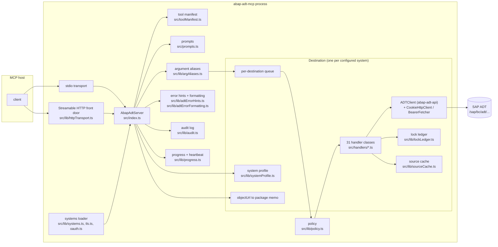
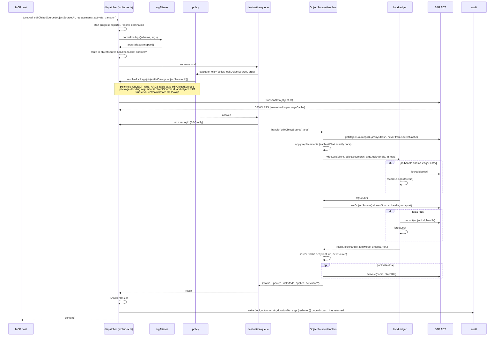

# Architecture

How abap-adt-mcp is put together: the process model, what a tool call goes through between the MCP host and SAP, the state kept per destination, how the catalog, docs, tests and releases are produced from one source of truth, and what touching each of those requires when you add a tool. Written from the code; every component names the file that implements it. For setup read [README.md](../README.md); for configuration keys [docs/CONFIGURATION.md](CONFIGURATION.md); for recipes [docs/WORKFLOWS.md](WORKFLOWS.md); for every tool and parameter [docs/TOOLS.md](TOOLS.md).

## Component map

## Process model

`src/index.ts` exports one class, `AbapAdtServer`, extending the MCP SDK `Server`. The module starts a server only when executed directly (`require.main === module`), so tests and `scripts/gen-tools-docs.js` import the class without side effects.

`run()` picks the transport from `MCP_HTTP_PORT`:

- **stdio** (default): one process, one `AbapAdtServer`, one `StdioServerTransport`, private to the host that spawned it.
- **Streamable HTTP**: `startHttp()` calls `startHttpServer(() => new AbapAdtServer(), opts)` in `src/lib/httpTransport.ts`. The factory is the point: every MCP session that sends `initialize` gets its own `AbapAdtServer`, hence its own destination pool, SAP sessions, lock ledgers and caches. Two callers on one endpoint never share an ADT session.

Both modes install `SIGINT`/`SIGTERM` handlers that call `close()` with a 5 second cap. `close()` walks the pool and, per destination, releases the locks in the ledger (`releaseAll`), clears the source cache, calls `dropSession()` if logged in, destroys the keep-alive `https.Agent`, then empties the pool. Over HTTP the same `close()` runs when a session is closed or swept for inactivity, which keeps a crashed agent from leaving objects locked in SM12. The instructions string sent at `initialize` lives in the constructor; the [README "What to ask the model"](../README.md#what-to-ask-the-model) section paraphrases it independently (the two are hand-written separately and nothing keeps their wording in sync; see "Docs generation and the contract test" below for which *numbers* elsewhere in README.md are kept in sync automatically, and which are not).

## Configuration load

`readSystems()` in `src/lib/systems.ts` runs once in the constructor and returns a `Map<string, SystemConfig>`. Sources in order: `SAP_SYSTEMS` (inline JSON), `SAP_SYSTEMS_FILE` or `systems.json` next to the package, then the single-destination `SAP_URL` family. Each entry passes through `resolveEnvRefs` (`${env:VAR}`), `parsePolicy` (`src/lib/policy.ts`) and `parseTlsConfig` (`src/lib/tls.ts`), then validation of the URL, the three-digit client and the credentials each auth type needs. A `systems.json` readable by other users is reported on stderr (`checkConfigFileMode`) and refused outright when it holds inline passwords instead of `${env:VAR}` references. `MCP_READ_ONLY=1` overlays `readOnly: true` on every policy. `defaultDestination()` honours `SAP_DEFAULT_DESTINATION`, then a `"default": true` entry, then the only entry when exactly one system is configured. The constructor warns once on stderr about `NODE_TLS_REJECT_UNAUTHORIZED=0` and each `insecureTls` destination. Keys are listed in [docs/CONFIGURATION.md](CONFIGURATION.md) and the [README configuration reference](../README.md#configuration-reference).

## The destination pool

A `Destination` (interface in `src/index.ts`) is created lazily by `getDestination(name)` on the first call that targets a system and lives until `close()`:

| Field | Purpose |
|---|---|
| `system` | the parsed `SystemConfig` |
| `adtClient` | the `abap-adt-api` `ADTClient`, set to `session_types.stateful` at creation |
| `cookieClient` | `CookieHttpClient` (`src/lib/cookieHttpClient.ts`), `authType: sso` only; receives the cookies harvested by the browser login |
| `bearerFetcher` | `BearerFetcher` (`src/lib/oauth.ts`), `authType: oauth` only; caches the client-credentials token until shortly before expiry, exposes `invalidate()` |
| `httpsAgent` | `https.Agent` from `buildHttpsAgent()` (`src/lib/tls.ts`) when the destination has a CA, client certificate, PFX or `insecureTls` |
| `handlers` | one instance of each of the 31 handler classes, all bound to the same `adtClient` (`buildHandlers`) |
| `loggedIn`, `loginInFlight` | SSO login state and the promise memoising a login in progress |
| `profile` | the memoised `Promise<SystemProfile>` |
| `packageCache` | `objectUrl -> DEVCLASS` memo for the `allowedPackages` policy gate |
| `queue` | the promise chain that serialises calls to this destination |

`makeClient()` builds the client per auth type: for SSO the `ADTClient` is constructed over the `CookieHttpClient` instead of a URL; for OAuth the bearer fetcher takes the place of a password; for basic auth the credentials go straight in. [docs/AUTH.md](AUTH.md) explains the modes. A second, never-connected `HandlerSet` (`schemaHandlers`) exists only to enumerate schemas for `tools/list`.

## The dispatcher, step by step

The `CallToolRequestSchema` handler in `setupToolHandlers()` reads the request, opens a progress reporter when the host sent a `progressToken`, calls `dispatch(name, rawArgs, onRetry)`, and after it settles (success or error) writes one audit record with the outcome. `dispatch()` itself runs this sequence:

1. **Server tools.** `listSystems` and `healthcheck` are answered without a destination or SAP. `listSystems` adds each destination's policy summary, TLS description and, once a profile exists, platform and unavailable toolsets.
2. **Destination resolution.** `args.destination || defaultDest`. Missing or unknown names are `InvalidParams` errors listing the configured destinations.
3. **Argument alias normalisation.** `normalizeArgs(schema, args)` (`src/lib/argAliases.ts`) maps what the caller sent onto the declared schema: a case-insensitive match first (`TransportNumber` to `transportNumber`), then alias groups (`objectSourceUrl`/`uri`/`url` for `objSourceUrl`, `source` for `code`, `className` for `clas`). Nothing moves when the target key already exists; renames are logged to stderr.
4. **Routing and toolset check.** `toolToHandlerKey` (from `TOOL_ROUTES`) names the owning handler. An unknown tool, or one whose toolset is not active under `MCP_TOOLSETS` / `MCP_DISABLED_TOOLSETS`, is `MethodNotFound` naming the toolset to enable. No SAP round trip yet.
5. **Enter the destination queue.** Everything below runs inside `dest.queue`.
6. **Policy evaluation.** With a `policy` on the destination, `evaluatePolicy()` (`src/lib/policy.ts`) runs the gates in order: `readOnly`, `deniedTools`, `allowFreeSql`, `deniedTables`, `allowedPackages`, `allowedTransports`. `allowedPackages` needs the target's package; the dispatcher supplies `resolvePackage()`, which calls `transportInfo` on the object URL and memoises `DEVCLASS` in `packageCache`. An unknown package in closed mode is a denial. Denials throw `InvalidRequest` with `Policy: <tool> blocked on destination <name> (<gate>): <reason>`, later classified as `policyDenied`. Which tools each gate actually inspects, and what a tool the gate has never heard of gets by default, is not the same for every gate: see step 4 of "Adding a tool" below. See also [README "Keeping it safe"](../README.md#keeping-it-safe).
7. **SSO login memoisation.** `ensureLogin(name, force)` is a no-op for basic and OAuth (they authenticate lazily in `abap-adt-api`). For SSO it runs `browserLogin()` (`src/lib/browserLogin.ts`, puppeteer-core over a persistent profile in `~/.abap-adt-mcp/sso/<host>`), hands the cookies to the `CookieHttpClient` and calls `adtClient.login()`. Concurrent callers share `loginInFlight`, so one browser window opens. The `login` tool forces a fresh login.
8. **systemProfile short-circuit.** Returns `getProfile(destination, refresh)`.
9. **Profile gate.** If the toolset has an entry in `TOOLSET_FEATURE` (`src/lib/systemProfile.ts`) and no profile exists, it is built now, so the outcome does not depend on whether `systemProfile` was called earlier. A tool listed in `unavailableTools` is refused (`MCP_PROFILE_GATE=enforce`, the default), logged (`warn`) or ignored (`off`); the refusal names the alternative (dumps instead of the debugger, ATC instead of traces). This gate has no per-tool granularity: it is keyed by toolset (`TOOLSET_FEATURE[toolset]`), so a single tool that needs a backend collection the rest of its toolset does not need cannot be gated on its own; either the whole toolset shares that gate, or the tool is left ungated and a caller finds out from the SAP error.
10. **Handler call.** `dest.handlers[handlerKey].handle(name, args)`.
11. **Session-expiry retry.** If the handler throws and `classifyAdtError` says `sessionExpired` or `csrf`, `reauthenticate()` runs and the call is retried exactly once. Re-authentication re-runs the browser login for SSO; for basic and OAuth it drops the session and logs in again, OAuth also invalidating the cached bearer so a fresh token is fetched; then it restores `stateful`, clears the source cache and calls `clearLedger()`, because every lock handle of the dead session is invalid. What that means for the retry depends on how the failed call was holding its lock: a tool that let the server auto-lock (no `lockHandle` argument) gets a fresh `auto` lock on the retry and normally succeeds, because `withLock` finds nothing in the now-empty ledger and acquires a new one; a tool that was passed an explicit `lockHandle` (typically from an earlier `lock` call) keeps trying to reuse that same now-dead handle on the retry, which SAP rejects, so the retry surfaces `staleLockHandle`, the honest outcome, since the object is genuinely unlocked. `logout` is never retried. The audit record gets `retried: true`.
12. **Package cache invalidation.** After `changePackageExecute`, `deleteObject`, `createObject`, `renameExecute`, `gitPullRepo` or `rapGenGenerate` (`PACKAGE_CACHE_INVALIDATORS`) the memo is cleared.
13. **Result to the host.** `dispatch()` passes the handler's (possibly retried) result through `serializeResult()`, which lets through anything that already carries `content` and wraps everything else as one JSON text block (bigint-safe), and returns that to `setupToolHandlers()`, which hands it to the transport.

Steps 6 to 12 run inside the queue; step 13 runs after the queue has released it. Progress and audit sit outside `dispatch()` entirely, in `setupToolHandlers()`:

- **Progress and heartbeat.** With `_meta.progressToken`, `createReporter()` (`src/lib/progress.ts`) builds a reporter, and `withProgress`/`withHeartbeat` wrap the call to `dispatch()` itself: `withProgress` stores the reporter in an `AsyncLocalStorage` so any handler can call `reportProgress()` without plumbing, and `withHeartbeat` sends "still running (Ns)" every 10 seconds so hosts do not time out on long ATC runs. Progress values are forced to increase, as MCP requires. Without a token everything is a no-op. This wrapping literally surrounds every step above, including destination resolution and the toolset check.
- **Audit.** With `MCP_AUDIT_FILE` set, one JSONL record per call (`src/lib/audit.ts`) is written once `dispatch()` has settled, not while it runs: request id, tool, destination, duration, outcome (`ok`, `error`, `denied`, `unavailable`), error kind, policy gate, a 300-character message and summarised arguments. Keys matching `pass`, `secret`, `token`, `authorization`, `cookie` or `lockhandle` become `[REDACTED]`; strings pass through `redactSecrets`. See [README "Audit log"](../README.md#audit-log).

### A write call end to end

On `sessionExpired` or `csrf` from the handler, `reauthenticate()` sits between the first handler call and a single retry; see step 11 above for whether that retry lands as a fresh auto lock or a `staleLockHandle`.

## Per-destination queue

`Destination.queue` is a promise chain: `dispatch()` appends its work with `dest.queue.then(work)` and stores `run.catch(() => undefined)` back, so a failure never breaks the chain for the next caller. The reason is the ADT protocol, not throughput. An `ADTClient` in `stateful` mode holds one server-side context carrying the enqueue locks, the CSRF token and the program loads. Two requests interleaved on that context can see each other's lock handles, activate half-written sources or trip the CSRF check. Serialising per destination keeps the stateful session consistent while calls to different systems still run in parallel. Policy resolution (`transportInfo`), SSO login, profile discovery, the handler and the retry all sit inside the queue for the same reason. `src/__tests__/dispatch.test.ts` pins the ordering.

## Lock ledger

`src/lib/lockLedger.ts` keeps a `Map<objectKey, LockEntry>` per `ADTClient` instance (one per destination, and over HTTP one per MCP session). Keys are `objectUrlOf(url).toLowerCase()`, which strips a trailing `/source/main`, `/source/<suffix>` or `/includes/<name>`, plus any query string or fragment, so a lock on a class and a write on its main source resolve to the same entry.

`withLock<T>(client, objectUrl, explicitHandle, fn, opts)` is the path of the write tools that lock and unlock by themselves (`setObjectSource`, `editObjectSource`, `setMethodSource`, `deleteObject`, `atcApplyQuickfix`, `createTestInclude` and `runSnippet`; the remaining write tools, `setDomainProperties`, `setDataElementProperties` and `setTextElements` among them, require an explicit `lockHandle` and call the client directly), where `fn: (lockHandle: string) => Promise<T>` does the actual write and `opts` is `{ accessMode?: string; keepOnSuccess?: boolean }`:

- `explicitHandle` is whatever the caller passed as the tool's `lockHandle` argument (`args.lockHandle` at every call site but `runSnippet`, which passes none for its throwaway class); when present it is used as-is and the lock is left in place, because the caller owns it (`lockMode: 'explicit'`).
- Otherwise the ledger is checked for an entry on this `objectKey`, typically because the model called `lock` first to hold the object across several writes; if found, that handle is reused and the lock stays (`lockMode: 'reused'`).
- Otherwise the object is locked here (`client.lock(objectUrlOf(objectUrl), opts.accessMode)`), `fn(handle)` runs, and the object is unlocked afterwards, on both success and failure (`lockMode: 'auto'`). If `fn` throws, `withLock` unlocks (best effort, swallowing that specific unlock error since the original error matters more), forgets the ledger entry, and re-throws the original error, the caller only ever needs to catch what `fn` itself can throw, not a separate lock-teardown error. On success without `opts.keepOnSuccess`, an unlock failure is returned as `unlockError` on the result, never swallowed. `keepOnSuccess` (used by `deleteObject`, and by `runSnippet` when it removes its throwaway class) skips the release and just forgets the ledger entry, since the object no longer exists to unlock.

The return value is `{ result, lockHandle, lockMode, unlockError? }`, where `result` is exactly what `fn` resolved to, so the caller gets its own payload back out and builds the tool's response around it (`const { result } = await withLock(...)` in `deleteObject` and `createTestInclude`; the source writes let `fn` resolve to `true` and use `written.lockMode` and `written.unlockError` instead). `accessMode` (forwarded to `client.lock`) lets a caller request a non-default lock mode when acquiring a fresh one; it has no effect on `explicit` or `reused` locks, which reuse whatever mode the lock already has.

`releaseAll` unlocks everything best effort and is used by `close()`, `logout`, `dropSession`, `forceUnlock` and the stateless flip below; `clearLedger` drops entries without talking to SAP, for a session that is already dead.

## Source cache

`src/lib/sourceCache.ts` is a second per-client cache, mapping a source URL to `{source, at, epoch}` with a 5 minute TTL (`MCP_SOURCE_CACHE_TTL_SECONDS`; `0` turns the time limit off, so entries live until the bucket is cleared by `logout`, `dropSession`, re-authentication or `close()`). Keying by client is deliberate: the same ADT URL exists on every system, and over HTTP in every session, so a URL-only cache would serve one destination's source, or one user's, to another. The source write tools (`setObjectSource`, `editObjectSource`, `setMethodSource`) store what they wrote, `getObjectSource` and `getMethodSource` what they read; `syntaxCheckCode`, `grepPackage`, `cdsViewInfo`, `typeHierarchy`, `abapDocumentation` and `apiReleaseState` read from it to spare a download. `editObjectSource`, `setMethodSource` and `atcApplyQuickfix` never read from it: they re-fetch from SAP so an edit lands on the current remote version. `clear(client)` empties one bucket; `clear()` bumps a global epoch that invalidates every bucket without enumerating the cache.

## System profile and the platform gate

`getProfile()` runs `adtDiscovery()` and a GET on `/sap/bc/adt/system/information`, then hands both to `buildSystemProfile()` in `src/lib/systemProfile.ts`. `collectionHrefs` flattens the discovery document; `detectFeatures` checks each entry of `FEATURE_COLLECTIONS` (debugger, traces, abapGit, ATC, RAP generator, service bindings, text search, API releases, feeds, data preview, unit tests, refactorings and more) against the hrefs; `TOOLSET_FEATURE` maps ten of the sixteen toolsets to the feature they need (the rest are never platform-gated). Missing features become `unavailableToolsets`, expanded to `unavailableTools` via `toolsOfToolset`, which is every tool of that toolset with no exceptions: the gate cannot single out one tool inside a toolset as needing (or not needing) the feature. Platform is `cloud` when the host matches the SAP cloud domain regex or the system information names a cloud edition, `onprem` otherwise, `unknown` when discovery is empty. The promise is memoised on the destination; a rejection resets it so the next call retries. `systemProfile(refresh=true)` rebuilds it. See the [README S/4HANA Cloud section](../README.md#s4hana-cloud-versus-on-prem).

## Error classification

Errors travel through three layers:

1. **`src/lib/adtErrorFormatting.ts`**: `formatAdtError()` is called by every handler (via `BaseHandler.formatAdtError`) when wrapping a caught error into an `McpError`. `abap-adt-api` sometimes swallows its own `exc:exception` parse and leaves "Request failed with status code NNN"; the formatter walks `response`, `parent` and `cause` for the raw body, re-parses the SAP message and `properties`, and appends `type`, `namespace` and `details`.
2. **`src/lib/adtErrorHints.ts`**: `classifyAdtError()` maps an error (object or text) to an `AdtErrorKind`: `policyDenied`, `sessionExpired`, `csrf`, `locked`, `staleLockHandle`, `transportRequired`, `authorization`, `notFound`, `rateLimited`, `ambiguous400`, `serverError`, `unknown`. It reads the HTTP status from the error chain or the message text and matches SAP phrasings (`ExceptionResourceNoAccess`, "is being edited by", "not assigned to a transport", "SU53"). Every kind but `unknown` carries `hint` and `nextTools`.
3. **`handleError()` in `src/index.ts`**: builds the `isError: true` response `{error, code, kind, httpStatus, hint, nextTools}` after `redactSecrets()`, which blanks Authorization and Cookie headers, `password` and `client_secret` values, and `user:pass@` URL credentials. The same classification drives the dispatcher's retry and the audit outcome.

## Response sizing

`src/lib/responseSizing.ts` caps tool output at `SAFE_OUTPUT_CHARS` (40,000 by default; `MCP_MAX_RESPONSE_CHARS` overrides, minimum 5,000), because hosts enforce token limits that code and JSON exhaust faster than prose. Handlers with a natural page size (source lines, query rows, list items) call `shrinkToFit(initialCount, buildPayload)`, which rebuilds the payload with a smaller count until it fits, at most eight times, passing `capped=true` so the payload can add its truncation note. When a single item still does not fit, or there is nothing to page over (a discovery document), `hardTruncateJson()` returns `{truncated: true, totalChars, preview}` with a character-level prefix. Twenty-one of the 31 handler classes use one of the two; the other ten return small fixed-shape results (auth, locks, deletion, registration, rename, refactoring, revisions, RAP generation, service bindings, text elements).

## runClass: stateless clone versus stateless flip

A stateful ADT session keeps the program load of a class it already ran, so after write and activate `runClass` on the same session prints the old output. `runClassFresh()` in `src/lib/runFresh.ts` (called from `CodeAnalysisHandlers` for `runClass` and from `SnippetHandlers` for `runSnippet`) avoids that in one of two ways, returned as `mode` and surfaced to the caller as the `runMode` field of both tool results:

- **`clone`**: `abap-adt-api` exposes `statelessClone`, a second client sharing the credentials. Available for basic and OAuth destinations; the stateful session and its locks are untouched.
- **`stateless`**: the SSO cookie client cannot be cloned, so the call goes out as a stateless request on the stateful session. ADT treats that like `dropSession`, which ends the context and every lock in it, so the ledger's locks are released first and returned in `locksInvalidated`; `stateful` is restored afterwards.

## HTTP transport internals

`src/lib/httpTransport.ts` is a plain `http.createServer` in front of the SDK's `StreamableHTTPServerTransport`:

- `readHttpOptions()` validates `MCP_HTTP_PORT` (1024 to 65535, or `0` for an ephemeral port in tests) and reads `MCP_HTTP_HOST`, `MCP_HTTP_TOKEN`, `MCP_HTTP_MAX_SESSIONS` (16), `MCP_HTTP_SESSION_TTL_MINUTES` (30), `MCP_HTTP_ALLOWED_ORIGINS` and `MCP_HTTP_ALLOWED_HOSTS`. Without a token, `startHttp()` generates one and writes it to `~/.abap-adt-mcp/http-token` with mode 0600.
- Request order: `GET /health` (unauthenticated), 404 outside `/mcp`, `hostAllowed` (DNS rebinding protection: on a loopback bind only loopback Host headers pass unless listed), `originAllowed` (absent Origin is accepted for non-browser clients), then `bearerOk`, a constant-time comparison on UTF-8 bytes that checks byte length first so `timingSafeEqual` cannot throw on a crafted token.
- Sessions live in a `Map<sessionId, {transport, server, lastActivity, createdAt}>`. A request carrying `mcp-session-id` is routed to its transport and refreshes `lastActivity`; one without must be a POST carrying `initialize`, gets 503 with `Retry-After` when the map is full, and otherwise creates a fresh `AbapAdtServer` through the factory plus a transport with a random UUID id. Only that opening body is read by `readBody()` and capped at 4 MB (`opts.maxBodyBytes`, which `readHttpOptions()` never sets from the environment); a request with an established `mcp-session-id` is handed straight to the SDK transport, which applies no size limit of its own.
- A sweeper runs every minute (or every TTL if shorter), unref'd, and closes sessions idle past the TTL. `closeSession` closes the transport, then the server, which is where `AbapAdtServer.close()` releases locks and drops the SAP session.

`startHttp()` warns when the bind is not loopback and, in that case, when any destination uses browser SSO, since remote callers would share one person's browser login. See the [README HTTP section](../README.md#http-transport-optional).

## Tool manifest and catalog

`src/toolManifest.ts` is the static metadata shared by the server, the contract test and the docs generator:

- `TOOL_ROUTES`: `HandlerKey -> tool names`, the only place a tool is tied to a handler. A compile-time check in `src/index.ts` (`_handlerSetCheck: Record<HandlerKey, unknown> = {} as HandlerSet`) guarantees every key of `HANDLER_KEYS` has a matching property in the `HandlerSet` interface, so a `HandlerKey` with no handler class fails the TypeScript build, not a test.
- `SERVER_TOOLS`: `listSystems`, `healthcheck`, `systemProfile`, served by the dispatcher directly rather than by a handler class.
- `READ_ONLY_TOOLS` and `DESTRUCTIVE_TOOLS`: two hand-maintained `Set<string>` literals of tool names, consulted by `toolAnnotations(name)`, which yields `readOnlyHint`, `destructiveHint`, `idempotentHint` (equal to read-only) and `openWorldHint` (true only for `apiReleaseState`, which downloads SAP's cloudification repository). `READ_ONLY_TOOLS` is also what the `readOnly` policy gate consults, so it does double duty: annotation and enforcement share one list. Neither set is derived from anything about the tool (no rule reads its schema, its handler, or a "destructive" flag on `ToolDefinition`); membership is a judgement call made when the tool was added. Looking at the current membership, `READ_ONLY_TOOLS` holds every tool that only reads or previews, plus `listSystems`/`healthcheck`/`systemProfile` (`login` and `logout` are in neither set: the `readOnly` gate lets them through its own `ALWAYS_ALLOWED` list in `policy.ts`, and `dropSession` sits in `DESTRUCTIVE_TOOLS`), and `DESTRUCTIVE_TOOLS` holds writes that overwrite or remove existing state outright, release irreversible actions, or run code (`deleteObject`, `transportDelete`, `transportRelease`, `setObjectSource`, `editObjectSource`, `setMethodSource`, `atcApplyQuickfix`, `gitUnlinkRepo`, `pushRepo`, `runClass`, `runSnippet`, `renameExecute`, `extractMethodExecute`, `changePackageExecute`, `debuggerSetVariableValue`, `tracesDelete`, `tracesDeleteConfiguration`, `unPublishServiceBinding`, `dropSession`, `setDomainProperties`, `setDataElementProperties`, `setTextElements`, `forceUnlock`). A write that only creates or appends new state without touching what was there before (`createObject`, `createTransport`, `lock`, `activateByName`, `gitCreateRepo`, `gitPullRepo`, ...) is left out of `DESTRUCTIVE_TOOLS` and annotated as a plain, non-destructive write. That is the pattern to follow for a new tool, not a written rule in the code. Judge whether the call can discard or overwrite something that already existed. README.md names destructive tools as illustrative examples in two places that do not fully agree with each other or with `DESTRUCTIVE_TOOLS`: the [Tool catalog](../README.md#tool-catalog-all-173-tools-by-toolset) section lists eleven "and others" as tools that "carry `destructiveHint: true`", and the [Keeping it safe](../README.md#keeping-it-safe) section's "Content from SAP is untrusted input" bullet gives an overlapping but shorter list for the same "review before approving" advice. Neither is meant to be exhaustive; the authoritative, complete list is `DESTRUCTIVE_TOOLS` itself.
- `TOOLSETS`: sixteen named groups of handler keys; `core` (the `auth` handler plus the server tools) cannot be disabled. `TOOLSET_PRESETS` defines `all` and `focused`. `resolveToolsets(env)` turns `MCP_TOOLSETS` (comma list or preset) and `MCP_DISABLED_TOOLSETS` into `{active, disabled, enabledTools, toolsetOf}` and throws on unknown names so a typo cannot silently hide tools.

`getToolCatalog()` builds the `tools/list` payload: it collects `getTools()` from every handler in `schemaHandlers`, keeps those in `enabledTools`, and passes each through `withDestination()`, which prepends the `destination` property (an `enum` of configured names, required when there is no default), attaches `examples` from the `PARAM_EXAMPLES` map (a `Record<string, any[]>` literal near the top of `src/index.ts`, keyed by parameter name, `objectUrl`, `objectSourceUrl`, `transport`, `objtype`, `sqlQuery` and about a dozen more) to any parameter of that name across every tool's schema when the handler's own `getTools()` did not already set `examples` on it, derives a `title` from the camelCase name (`getObjectSource` becomes `Get Object Source`; `ATC`, `ADT`, `DDIC`, `RAP` and similar acronyms are upper-cased) and sets `annotations` from the manifest. The three server tools are appended last.

Every handler extends `BaseHandler` (`src/handlers/BaseHandler.ts`), which supplies the logger, per-instance request/success/error metrics and `formatAdtError`, and declares two abstract members every concrete handler implements:

- `getTools(): ToolDefinition[]`: one entry per tool the handler serves. `ToolDefinition` (`src/types/tools.ts`) is `{ name, description, inputSchema: { type: 'object', properties: Record<string, { type, description?, optional?, enum? }>, required?: string[] }, annotations?: ToolAnnotations }`. A property's `description` is where per-parameter guidance and, when the handler wants one that `PARAM_EXAMPLES` will not attach, an inline example belong; `annotations` is normally left unset, since `toolAnnotations(name)` derives it centrally from `READ_ONLY_TOOLS`/`DESTRUCTIVE_TOOLS`, a handler only sets it to override that default for one tool.
- `handle(command: string, args: any): Promise<any>`: a `switch (command)` over the tool names the handler owns (see `TOOL_ROUTES`). It reaches its ADTClient through `this.adtclient` (set once in the constructor `BaseHandler` provides), calling `abap-adt-api` methods on it directly and, for a write that locks by itself, wrapping the SAP calls in `withLock(this.adtclient, ...)` from `src/lib/lockLedger.ts` and, for a source write, calling `sourceCache.set(this.adtclient, ...)` from `src/lib/sourceCache.ts` afterwards. The return value can be a plain object, which `serializeResult()` wraps as a JSON text block, or an object already shaped as `{content: [...]}`, which passes through unchanged; handler tests parse `JSON.parse(response.content[0].text)` either way.

## Adding a tool

There is no single call that wires up a new tool; it touches a fixed list of files, and several of them are silent about a tool they were never told about rather than refusing it. In file order:

1. **Handler.** Add the tool's `ToolDefinition` to an existing handler's `getTools()` (the common case, most handler classes serve several related tools) and a `case` in its `handle()`. Reuse the canonical parameter names from an existing tool of the same shape (`objectSourceUrl`, `transport`, `code`, `lockHandle`, ...) rather than inventing new ones: `src/lib/argAliases.ts`'s `GROUPS` already map common misspellings onto those names, so a tool that uses them benefits from `normalizeArgs` for free. A genuinely new concept (not a synonym of an existing one) needs its own entry added to `GROUPS`; nothing needs to change there for a tool that reuses existing names, even in a new handler class.
2. **New handler class only:** if the tool does not belong to any existing handler, create the class extending `BaseHandler`; add its key to `HANDLER_KEYS` and its tool names to `TOOL_ROUTES` (both in `src/toolManifest.ts`); add the matching property to the `HandlerSet` interface, a line in `buildHandlers()` and an entry in the `allDomainTools()` list (all three in `src/index.ts`, the `_handlerSetCheck` compile-time check there catches a `HANDLER_KEYS` entry with no `HandlerSet` property, but not the reverse, and nothing checks `allDomainTools()`, whose omission would leave the tools out of `tools/list`); and put its handler key into one `TOOLSETS` entry's `handlers` array (a new toolset name if it does not fit an existing one, in which case also decide whether it belongs in `TOOLSET_PRESETS.focused`).
3. **Annotations.** Decide `READ_ONLY_TOOLS` vs `DESTRUCTIVE_TOOLS` vs neither in `src/toolManifest.ts` by the judgement call described in "Tool manifest and catalog" above (reads and previews go in the first set, writes that overwrite or remove existing state or execute code go in the second, plain creates/appends go in neither). Add the tool name to at most one of the two sets; omitting it from both is a valid, common choice for a recoverable write.
4. **Policy gates**, only if the tool is a write a `systems.json` policy should be able to restrict, in `src/lib/policy.ts`:
   - `readOnly` and `deniedTools` need nothing done: `readOnly` already blocks any tool absent from `READ_ONLY_TOOLS` and `ALWAYS_ALLOWED`, and `deniedTools` globs against the tool name directly, so both cover a new tool automatically once it exists.
   - `allowFreeSql` only ever inspects `runQuery` and `tableContents`; it is not extensible and irrelevant to any other tool.
   - `deniedTables` only scans ABAP/SQL text for `runSnippet`'s `code`, `setObjectSource`'s `source` and `setMethodSource`'s `source`, plus `tableContents`'s `ddicEntityName` and any tool's `sqlQuery`. **This is a hardcoded, closed list of tool names inside `evaluatePolicy()`, not a rule keyed on "carries ABAP source" or "carries SQL".** Notably `editObjectSource`'s `replacements`/`newText` are not scanned even though they carry ABAP text, which is a real gap in the current code, not a documentation omission, a `deniedTables` entry does not stop a denied table name from reaching SAP through `editObjectSource`. A new tool that writes or executes ABAP text a `deniedTables` policy should see over it needs an explicit branch added here; otherwise it is silently exempt from this gate regardless of what it sends.
   - `allowedPackages` resolves the target package through one of several hardcoded branches in `evaluatePolicy()`: a few tools get bespoke handling (`createObject` via `parentName`/`parentPath`, `runSnippet` and `activatePackage` via `packageName`, `activateObjects` by parsing its `objects` JSON payload and checking the package of each of the first 50 listed objects individually, `renameExecute`/`extractMethodExecute` by parsing the `refactoring` payload for one object's package, `changePackageExecute`/`changePackagePreview` via the refactoring's `newPackage`, `createTestInclude` via `clas`, `gitCreateRepo` via `packageName`); most tools instead go through the `OBJECT_URL_ARGS: Record<string, string>` table, which names the one argument holding the object's URL (`editObjectSource` → `objectSourceUrl`, `setMethodSource` → `classUrl`, `deleteObject`/`lock`/`activateByName`/`setTextElements`/`changePackagePreview` → `objectUrl`, `setDomainProperties` → `domainUrl`, `setDataElementProperties` → `dataElementUrl`, `atcApplyQuickfix` → `objectSourceUrl`); the URL is passed through `objectUrlOf()` (stripping `/source/main` and similar suffixes) before `resolvePackage()` looks it up. **A write tool that appears in none of these, not in `OBJECT_URL_ARGS`, not one of the bespoke branches, and not in `UNRESOLVABLE_WRITES`, is simply not checked: `allowedPackages` lets it through regardless of the destination or package, closed mode or not.** This is different from "refused as unresolvable": that only happens for tools explicitly listed in `UNRESOLVABLE_WRITES` (`gitPullRepo`, `rapGenGenerate`, `publishServiceBinding`, `unPublishServiceBinding`, `rapGenPublishService`), which are refused precisely because someone already decided they should be gated but their target package cannot be derived. A new write tool whose package can be determined from an argument needs an `OBJECT_URL_ARGS` entry (or a bespoke branch, for anything that is not a single object URL); a new write tool whose package genuinely cannot be derived, and that should still be blocked in closed `allowedPackages` mode rather than silently allowed, needs adding to `UNRESOLVABLE_WRITES` instead. Simply adding the tool to `TOOL_ROUTES` does **not** make `allowedPackages` gate it either way.
   - `allowedTransports` checks the argument named in `TRANSPORT_ARGS: Record<string, string>`, another hardcoded per-tool-name table (`transport` for most source/object writes, `transportNumber` for `transportRelease`/`transportDelete`/`transportSetOwner`/`transportAddUser`). A tool carrying a transport under a different argument name, or absent from this table altogether, is not checked by this gate even if `allowedTransports` is set, same silent-pass behaviour as an unlisted `allowedPackages` tool. The one exception is creation: `createTransport`, and `resolveTransport` with `createIfMissing: true`, are refused outright whenever `allowedTransports` is set, whatever the table says.
   - Extend `src/lib/__tests__/policy.test.ts` for whichever of these branches you touched; a tool that only needed step 3's annotation, with no policy.ts change, needs no policy test.
5. **Parameter examples**, optional: add an entry to the `PARAM_EXAMPLES` map in `src/index.ts` if the tool introduces a new parameter name worth an example (existing names such as `objectUrl` or `transport` already have one, applied automatically). Prefer this over an inline `examples` array in the tool's own `ToolDefinition`, which the catalog builder leaves alone if present but which most tools do not set.
6. **Curated note**, optional: add an entry to `docs/tool-notes.json`, keyed by tool name, shaped `{ "when": "...", "returns": "...", "pitfalls": "...", "seeAlso": ["otherTool", ...] }`. `scripts/gen-tools-docs.js` merges this into the generated `docs/TOOLS.md` entry for the tool; a tool with no entry still gets a `docs/TOOLS.md` section built from its schema alone.
7. **Tests.** Add cases to the handler's existing test file in `src/handlers/__tests__/` if one exists (`ObjectSourceHandlers`, `TransportHandlers`, `SearchHandlers`, `FeedHandlers`, `CloudSnippetHandlers`, `NavigationExtras`, `AtcExport` today); the pattern throughout is a plain object literal standing in for the `ADTClient`, with a `jest.fn()` per `abap-adt-api` method the handler calls (plus a `stateful` property the handler reads/sets), passed to `new XHandlers(client)`, then `await handler.handle('toolName', args)` with the result parsed as `JSON.parse(result.content[0].text)`. Most of the 31 handler classes have no dedicated test file at all today and rely only on the contract test below for shape; adding one for an untested handler class is optional but follows the same pattern. `src/__tests__/dispatch.test.ts` covers dispatcher-level mechanics (queue ordering, the retry, the profile gate, alias mapping, policy running before the handler) and normally needs no change for a single new tool, only extend it if the tool changes one of those mechanics itself. `src/lib/__tests__/policy.test.ts` only needs extending when step 4 touched `policy.ts`.
8. **Regenerate.** Run `npm run tools:docs` (builds first). This is not optional: `src/__tests__/toolCatalog.test.ts` fails if `docs/tools.snapshot.json` is stale, and CI fails the same way by diffing the generated files. See "Docs generation and the contract test" below for exactly what it rewrites and, just as importantly, what it does not.

## Prompts

`src/prompts.ts` defines six prompts (`create-object`, `safe-edit`, `review-transport`, `fix-atc`, `clean-core-check`, `debug-dump`) as `PromptDef` entries with typed arguments and a `render` function producing the user message. `listPrompts()` serves `prompts/list`; `getPrompt(name, args)` validates required arguments and returns the single-message payload for `prompts/get`. Every step names a real tool of this server, checked by `src/__tests__/prompts.test.ts`. See the [README "Built-in prompts"](../README.md#built-in-prompts) section and [docs/WORKFLOWS.md](WORKFLOWS.md).

## Docs generation and the contract test

`scripts/gen-tools-docs.js` (`npm run tools:docs`, which builds first) loads `dist/index.js` with a throwaway `SAP_SYSTEMS` entry, instantiates `AbapAdtServer` and reads `getToolCatalog()` and `getToolsets()`. It writes:

- `docs/TOOLS.md`: the toolset table, a summary per toolset and a details section per tool with every parameter and up to two examples, merged with the curated notes in `docs/tool-notes.json` (`when`, `returns`, `pitfalls`, `seeAlso` per tool, described in "Adding a tool" above).
- `docs/tools.snapshot.json`: version, count, tool names per toolset, and per tool its toolset, read-only and destructive flags, required and declared parameters.
- Six narrow, regex-targeted in-place rewrites across three files, and nothing else: in `README.md`, `exposes **N tools**` (the intro), `## Tool catalog (all N tools, by toolset)` (the section heading, matched with its `##` prefix so a Table-of-Contents line cannot match), `` `focused` = N development tools `` and the toolset table rows under `| Toolset | In `focused` | Tools |`; in `skills/abap-adt-mcp-setup/SKILL.md`, the `` `MCP_TOOLSETS=focused` (N development tools instead of M) `` phrase; in `.claude-plugin/plugin.json`, the `: N tools over` phrase in `description`. Each is a plain string or regex substitution against the file's current text, not a templating system with named slots, so it only fires where the exact pattern occurs, and none of the regexes is global: only the first match in a file is rewritten.

That rewrite is narrow by design, and two things in README.md sit outside what it matches even though they carry the same numbers: an earlier section explains `MCP_TOOLSETS=focused` a second time, in free prose ("publishes the *N* development tools instead of all *M*") rather than the templated `` `focused` = N development tools `` phrase the regex looks for elsewhere in the file, so a tool-count change updates the templated occurrence but leaves this prose restatement stale unless someone edits it, or the generator's regex, by hand; and README.md's own Table of Contents links to "Tool catalog (all *N* tools, by toolset)" as literal link text plus a GitHub-generated anchor slug derived from the heading, the heading rewrite above keeps the heading itself current, but nothing updates the Table of Contents entry or notices that its anchor has silently drifted out from under it. Neither is checked by CI's docs-freshness diff (that diff only looks at `docs/TOOLS.md`, `docs/tools.snapshot.json` and the three files the script rewrites in place), so both need a manual look whenever the tool count changes, even right after `npm run tools:docs` ran cleanly. Outside README.md, `skills/abap-adt-mcp/SKILL.md` (the usage skill the model reads, distinct from `skills/abap-adt-mcp-setup/SKILL.md`, which the generator does rewrite) and `docs/ROUTING.md` do not state a tool count at all today, so there is nothing there to go stale; `CHANGELOG.md`'s per-release tool counts are historical snapshots by design and are not meant to track the current total.

`src/__tests__/toolCatalog.test.ts` is the contract test. It parses the catalog with the SDK's `ListToolsResultSchema`, checks that names are unique, that every published tool is routed and every routed tool is published (except the legacy alias `adtCompatibiliyGraph`), that every tool has a `title` equal to `annotations.title`, boolean `readOnlyHint` and `destructiveHint`, typed parameters and a `destination` property (except `listSystems` and `healthcheck`), and that names, flags and required parameters match `docs/tools.snapshot.json`. Changing a tool without `npm run tools:docs` fails this test, and CI also diffs the generated files against the commit.

## Test layout

Tests are Jest with `ts-jest` (`jest.config.js`), rooted at `src/` and matched by `**/__tests__/**/*.test.ts`. Sources import siblings with a `.js` suffix while compiling to CommonJS, so `moduleNameMapper` strips it (`'^(\\.{1,2}/.*)\\.js$': '$1'`). Coverage is on by default; CI passes `--coverage=false`. `tsconfig.test.json` extends `tsconfig.json` with `noEmit` and the `jest` and `node` types and includes the tests, so `npx tsc --noEmit -p tsconfig.test.json` type-checks them; the production `tsconfig.json` excludes `src/**/__tests__/**` so they never reach `dist/`.

Three groups:

- `src/lib/__tests__/`: one file per library module (policy, lockLedger, sourceCache, systemProfile, adtErrorHints, argAliases, audit, progress, responseSizing, runFresh, sqlReflow, systems, tls, toolManifest and the rest).
- `src/handlers/__tests__/`: handler tests against a mocked `ADTClient` (ObjectSource, Transport, Search, Feed, CloudSnippet, NavigationExtras, AtcExport); see "Adding a tool" above for the mocking pattern they share.
- `src/__tests__/`: `dispatch.test.ts` (destination resolution, policy before handler, per-destination ordering, re-auth retry, profile gate, package memo invalidation, `close()`, alias mapping), `httpTransport.test.ts`, `prompts.test.ts` and the contract test. The three that load `src/index.ts` mock `puppeteer-core`, which is ESM-only and never needed in tests.

Live checklists against real systems are in [docs/TESTPLAN.md](TESTPLAN.md); the field observations behind several mechanisms above (the 255-character data preview line handled by `src/lib/sqlReflow.ts`, the parameter names agents guess) are in [docs/FIELD-NOTES.md](FIELD-NOTES.md); the stale `runClass` load is recorded in [CHANGELOG.md](../CHANGELOG.md) and in the header of `src/lib/runFresh.ts`.

## CI and release pipeline

`.github/workflows/ci.yml` runs on pushes to `main` and on pull requests. The `test` job runs on Node 18, 20 and 22: `npm ci`, `npm run build`, type-check the tests, `npm test -- --coverage=false`, regenerate the docs and fail on any diff in the generated files, then assert that `server.json` (`version` and `packages[0].version`) agrees with `package.json`. The `docker` job builds the `Dockerfile` (two-stage `node:22-alpine`, `npm prune --omit=dev`, runtime as user `node`) and pipes `initialize`, `notifications/initialized` and `tools/list` into the container to confirm `listSystems` is listed.

`.github/workflows/release.yml` runs on `v*` tags with `id-token: write` and `packages: write`. It checks that the tag equals `package.json` and `server.json`, repeats build, type-check, tests and docs freshness, verifies with `npm pack --dry-run` that no compiled `__tests__` ship, installs npm 11.5.1 or later and publishes with `npm publish --provenance --access public` through npm trusted publishing (OIDC, no stored token), then pushes `ghcr.io/williansaez/abap-adt-mcp:<tag>` and `:latest`. `server.json` is the MCP registry manifest for `io.github.williansaez/abap-adt-mcp`, listing the npm package, the stdio transport and 32 environment variables, with a secret flag on the four that carry credentials (`SAP_SYSTEMS`, `MCP_HTTP_TOKEN`, `SAP_PASSWORD`, `SAP_OAUTH_CLIENT_SECRET`). Two variables the server reads are not declared there: `MCP_CACHE_DIR` and `NODE_TLS_REJECT_UNAUTHORIZED`, which is only inspected in order to warn against it. The [README "Testing and contributing"](../README.md#testing-and-contributing) section has the local commands.
